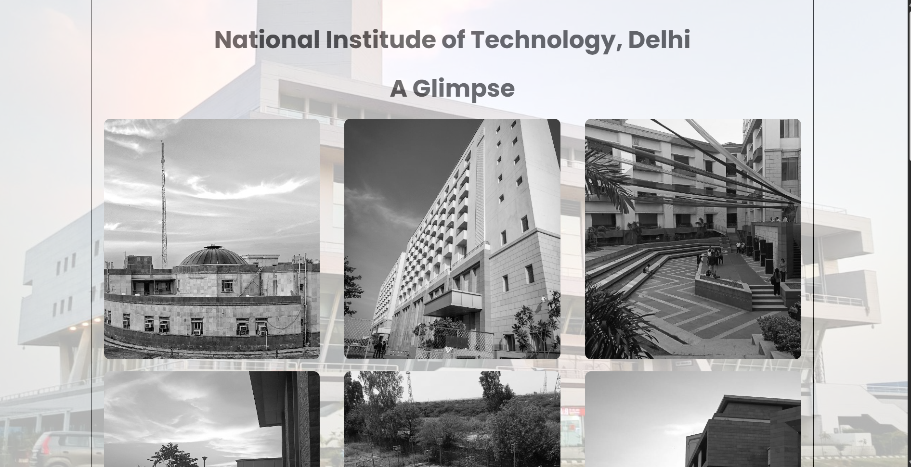

# NIT Delhi Glimpse

A web-based photo gallery showcasing various glimpses of the National Institute of Technology, Delhi (NIT Delhi). This project provides a visual tour of the campus, featuring various buildings, hostels, and other key areas of the institute.



## Features

- **Responsive Design**: Ensures a seamless viewing experience across different devices and screen sizes.
- **Photo Gallery**: Displays images with captions to give users a glimpse of the NIT Delhi campus.
- **Stylish Layout**: Utilizes modern CSS for a visually appealing layout.

## Demo

You can view the application live here: [Demo Link](https://mkraj-7838.github.io/NITD-glimpse/)

## Installation

To get a local copy up and running, follow these simple steps:

1. **Clone the repo**
    ```sh
    git clone https://github.com/your-username/NITD-glimpse.git
    ```

2. **Navigate to the project directory**
    ```sh
    cd NITD-glimpse
    ```

3. **Open `index.html` in your browser**

## Usage

1. Open the `index.html` file in your preferred web browser.
2. Scroll through the gallery to view images of various parts of the NIT Delhi campus.
3. Each image has a caption providing information about the location depicted.
